# Flexible Web Fullstack Local Environment 

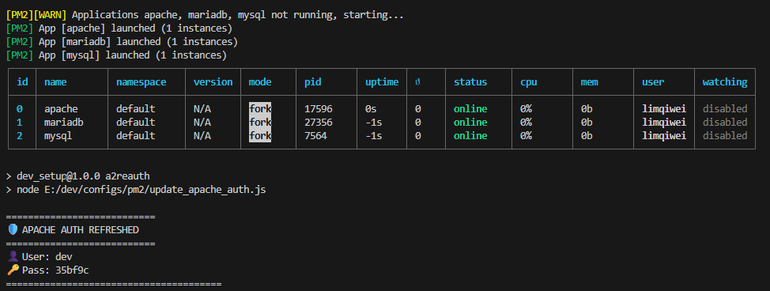

This is an suggested guide to setup a relatively flexible webstack using Apache, PHP, MariaDB/MySQL. Based on my personal opinion 😆


# Jump To
* [Motivations](#motivations)
* [Platforms](#platforms)
* [Template Structure](#template-structure)
* [Port Usage](#port-usage)
* [Installation](#installation)
* [Configuration](#configuration)
* [Sanity Checks](#sanity-checks)
* [Usage](#usage)
* [Apache Password Mode](#apache-password-mode)
* [Troubleshooting](#troubleshooting)
* [Reference Links](#reference-links)

# Motivations
* Work with multi-PHP projects seamlessly.
* Reduce need for switching due to conflicting ports.
* Extensible to greater number of server, php or database servers. You are limited by your local port range

# Platforms
This guide is currently only written and tested for Windows. 

# Template Structure
You may wish to git clone this repository and use the structure in the [`template`](/template/) folders.

## Folder Organization
The following is one preferred way to organize the tools. Feel free to adjust according to your needs.

`configs` To consist of custom configurations that can be moved out.

`data` Contains runtime or external data. Such as apache logs, database data, or temporary data for uploaded files for PHP runtime

`projects` Root folder for source code of projects, which can be placed here for conveience. There may not be limited to web projects.

`tools` Contains all the tools used for development. For now this guide only includes the tools related to setting up a working web development environment. Other tools may also be placed here to consolidate all tools related to dev works.

`docs` Contains any non-code. May be used for documentation, notes, etc.


```bash
└───dev
    ├───configs
    │   ├───apache
    │   │       .htpasswd # Dynamically generated password file.
    │   │       httpd.conf 
    │   │       vhost.conf
    │   │       
    │   ├───mariadb
    │   │       my.ini
    │   │       
    │   ├───mysql
    │   │       my.ini
    │   │       
    │   └───pm2
    │           dev.config.js # PM2 Daemon Start Up Configuration
    │           update_apache_auth.js # Node Script to regenerate dev/configs/apache/.htpasswd
    │
    ├───data
    │   ├───apache # Stores apache logs
    │   ├───mariadb # Data Directory for MariaDB
    │   ├───mysql # Data Directory for MySQL
    │   └───php # Tmp Directory for File Uploads
    ├───projects
    └───tools
        ├───apache
        │   └───2.4.66
        │       └───bin
        ├───mariadb
        │   └───11.8.5
        │       └───bin
        ├───mysql
        │   └───8.4.7
        │       └───bin
        ├───node
        │   └───24.11.1
        │       └───bin
        ├───php
        │   └───8.4.5
        │       └───lib
        └───phpMyAdmin
        │   └───8.4.5
        │       └───lib
```

# Port Usage
These are the ports that will be used for this guide. Feel free to adjust the port settings if there are existing port conflicts on your local machine.

| Port | Used By |
| ---- | ------- |
| 9000 | Demo Project 1 |
| 9110 | MariaDB |
| 9111 | MySQL |
| 9120 | phpMyAdmin |


# Installation
For flexiblility, the choice of this setup is to use zip archives instead of installers. For the tools belows, download the `ZIP` archives.

## Download all applicable tools
| Tool | Download Link | Remarks |
| ----------- | ----------- | --- |
| Apache | https://www.apachelounge.com/download/ | - |
| Apache Module: mod_fcgid | https://www.apachelounge.com/download/ | For PHP-CGI |
| MariaDB | https://www.apachelounge.com/download/ | - |
| MySQL | https://dev.mysql.com/downloads/mysql/ | - |
| PHP   | https://windows.php.net/download/ | - |
| PHP   | https://windows.php.net/downloads/releases/archives/ | For Older PHP Versions |
| PhpMyAdmin | https://www.phpmyadmin.net/downloads/ | Optional |
| Node.js | https://nodejs.org/en/download | For using PM2 tool |


## Extract all tools into folder
Refer to the template structure suggested under [`Template Structure`](#template-structure).
Extract the zip file into the respective tools folder. 
> <font color='#c96443'>**Ensure that the folder is extracted at the correct folder hierarchy level.**</font>

> Apache's mod_fcgid: Follow the instructions to extract the module into `modules` folder in the apache server root

## Configuration

### Apache Configurations

#### `conf/httpd.conf`
Open `conf/httpd.conf` under your apache server root folder and make the following changes.

Update server root to match your installation server root:<br><br>
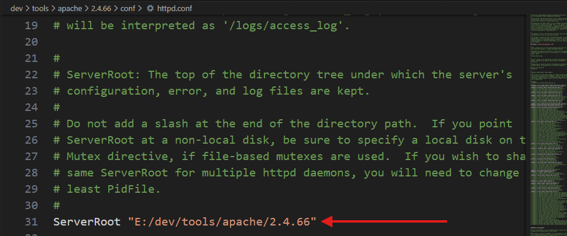

Comment out the line that Listen 80 since we are not configuring that here.<br><br>
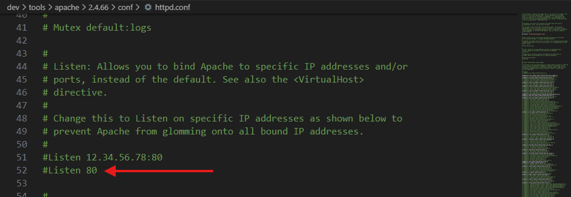

Comment out default directory root setting since we are not configuring that here.<br><br>
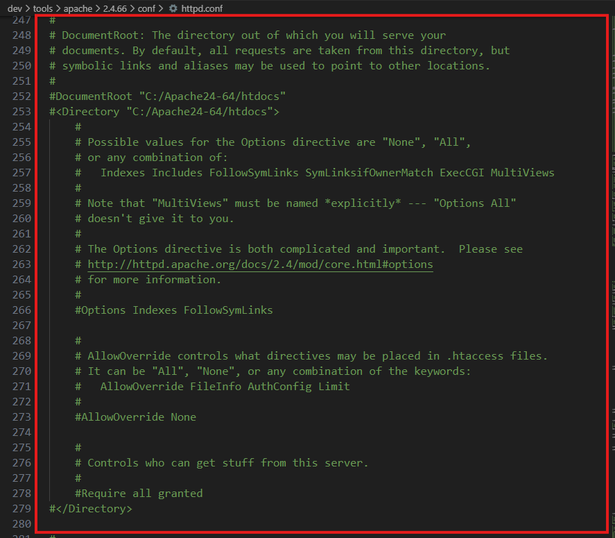

Add these lines at the end of the file to include the custom configuration provided.

```
Include E:/dev/configs/apache/httpd.conf
Include E:/dev/configs/apache/vhost.conf
```
<br><br>
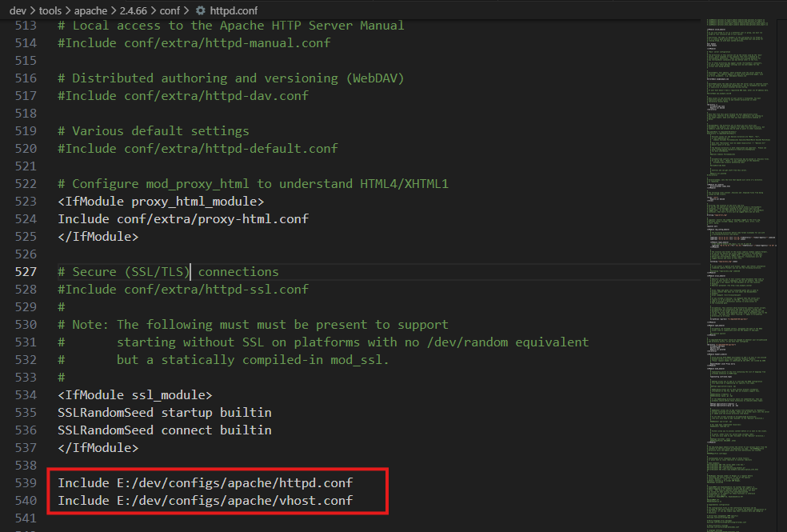

#### `dev/configs/apache/vhost.conf`

This is where we configure the PHP Version, Project webroot folder. Using the VHost Macro
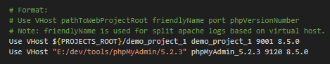

If you are not using the template structure suggested under [`Template Structure`](#template-structure), you would need to update the paths as marked in the image below if<br><br>
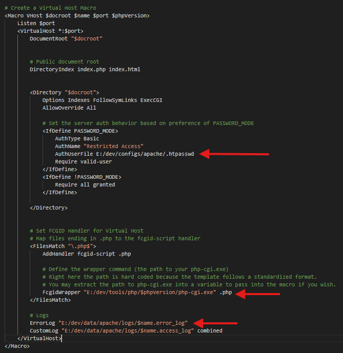

### PHP Configuration

#### `php.ini`

Copy `php.ini-development` and rename into `php.ini`


Open `php.ini`. Update the system temp directory so that any temporary files will flow to the `data` directory.

```
sys_temp_dir = "E:/dev/data/php"
```

At this point you should enable common PHP settings needed for your development. Some common settings and extensions are indicated below.

```ini
extension_dir = "ext" # Uncomment and enable to use extensions.

extension=curl
extension=fileinfo
extension=gd
extension=mbstring
extension=mysqli
extension=openssl 
extension=pdo_sqlite
```

### MariaDB Configuration

#### Installation

From the `bin` folder of the mariadb, run this command with the default file path pointing to provided my.ini

Note: The provided configuration file path is located in `dev/configs/mariadb/my.ini`

```
mariadb-install-db.exe --defaults-file=path/to/your/my.ini
```

After running this command, the default database tables will be created under dev/data/mariadb. 

Note: By default MariaDB will be initialized without any password. This may change in the future.

### MySQL Configuration

#### Installation

From the `bin` folder of the mysql, run this command with the default file path pointing to provided my.ini

Note: The provided configuration file path is located in `dev/configs/mysql/my.ini`

```
mysqld.exe --defaults-file=path/to/your/my.ini --initialize --user=mysql
```

After running this command, the default database tables will be created under dev/data/mysql

#### Updating Password
By default recent versions of MySQL will be initialized with a password. You may find the temporary password in the data folder. The file to find the password will end with a `.err` extension.

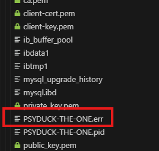

Open that file and find for a line that says.

```text
A temporary password is generated for root@localhost:...
```

Copy the password.

Now open a cmd line and navigate to the `bin` folder of your mysql installation.

Run your mysql server manually using

```bash
mysqld.exe --defaults-file=E:/dev/configs/mysql/my.ini
```

Open a second terminal, in the same `bin` folder. Connect to the mysql server with your temporary generated password

```bash
mysql.exe --host=localhost --port=9111 --user=root --password=yourTempPassword
```

Once connected update your password to something that you desire.

```bash
ALTER USER root@localhost IDENTIFIED BY 'mydevpassword'
```

After this you can try connecting to your mysql to verify that your password has been updated. 

### PhpMyAdmin Configuration

From the root project of PhpMyAdmin, duplicate the file `config.sample.inc.php` and rename the file as `config.inc.php`

Open config.inc.php and paste this configuration into the server configuration block

```php
/**
 * MariaDB First DB Server Connection Setting
 */
$i++;
$cfg['Servers'][$i]['auth_type'] = 'config';
$cfg['Servers'][$i]['host'] = 'localhost';
$cfg['Servers'][$i]['port'] = '9110';
$cfg['Servers'][$i]['verbose'] = 'MariaDB';
$cfg['Servers'][$i]['compress'] = false;
$cfg['Servers'][$i]['AllowNoPassword'] = true;
$cfg['Servers'][$i]['username'] = 'root';

$i++;

/**
 * MySQL Second DB Server Connection Setting
 */
$cfg['Servers'][$i]['auth_type'] = 'config';
$cfg['Servers'][$i]['host'] = 'localhost';
$cfg['Servers'][$i]['port'] = '9111';
$cfg['Servers'][$i]['verbose'] = 'MySQL';
$cfg['Servers'][$i]['compress'] = false;
$cfg['Servers'][$i]['AllowNoPassword'] = false;
$cfg['Servers'][$i]['username'] = 'root';
$cfg['Servers'][$i]['password'] = 'mydevpassword';
```


### Node & PM2 Configuration


`dev.config.js` contains the instruction on what services to start. See `dev/configs/pm2/dev.configs` under provided [`Template Structure`](#template-structure) to see the options used.

For more configuration you may refer to the PM2 Main documentation. See [`Reference Link`](#reference-links)

Under the node root folder (containing `node.exe`), run this command

```bash
npm install pm2 -g
```

Copy the `nodejs_package.json` file from `configs/pm2/nodejs_package.json` into your node root folder and rename it into `package.json`

The package.json comes with some default scripts to start your entire dev ecosystem. You would need to update the path as indicated below below.

`package.json`
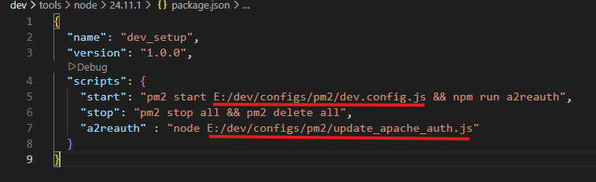

`dev.config.js`
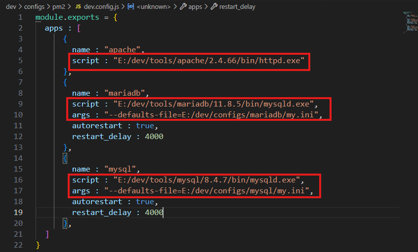

# Sanity Checks
As PM2 is just a process daemon manager. You can run the commands defined in `dev.config.js` manually, from the respective `bin` folder appropriately. This will allow you to test and make sure that each individual component is working. 

Once ready refer to [`Usage`](#usage)

# Usage
From the node root folder and run `npm start` in the command line.

## Starting Ecosystem
```bash
cd E:/dev/tools/node/24.11.1/
npm start
```

If you are following the template [`Template Structure`](#template-structure), you should see this screen on success on `localhost:9000`

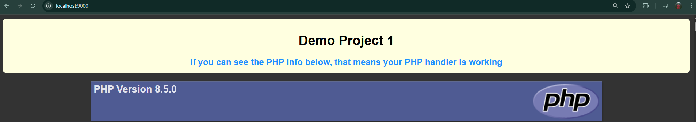


## Stopping Ecosystem
```bash
cd E:/dev/tools/node/24.11.1/
npm stop
```


# Apache Password Mode
This can be enabled to add 1 layer of security. Such as if you want to prevent other devices from accessing your website via your device IP address, on the same WIFI network. Without the password (regenerated on each pm2 restart), the apache server will reject the access.

If you have enable password mode in apache. Then you would need to enter a password to be authenticated to be allow to access the Apache Server.

`dev/configs/apache/vhost.conf` Configuration for password mode.
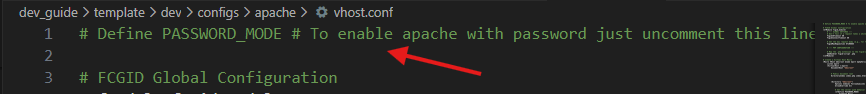

Example screenshot where credentials is required
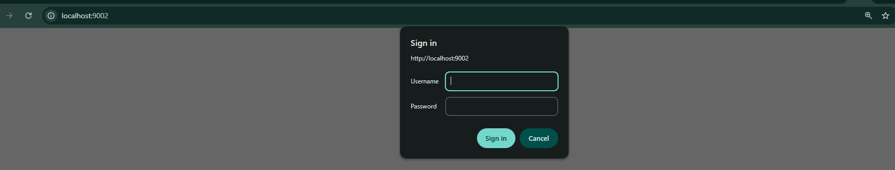

To access, copy the credentials and enter it in the dialog.

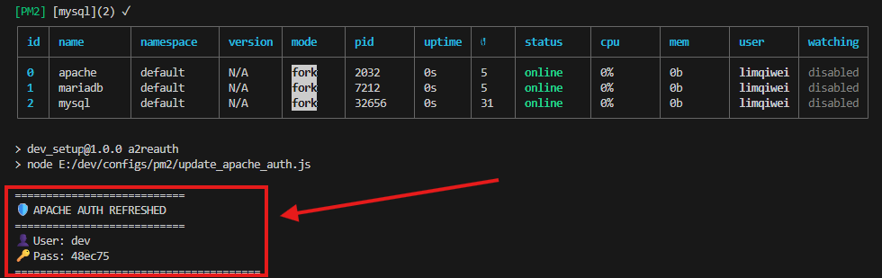

# Troubleshooting
Here are some common areas to check for logs if there are some errors.

* PM2 - Check logs of individuals using `pm2 logs` command
* Apache - Check logs under `/data/apache/logs`

# Reference Links

Apache
* https://httpd.apache.org/docs/2.4/sections.html
* https://httpd.apache.org/mod_fcgid/mod/mod_fcgid.html

MariaDB
* https://mariadb.com/docs/server/clients-and-utilities/deployment-tools/mariadb-install-db

MySQL
* https://dev.mysql.com/doc/refman/8.4/en/data-directory-initialization.html
* https://dev.mysql.com/doc/refman/8.4/en/mysqld-safe.html
* https://dev.mysql.com/doc/refman/8.4/en/connecting.html

NodeJS - PM2
* https://pm2.keymetrics.io/docs/usage/quick-start/
* https://pm2.keymetrics.io/docs/usage/application-declaration/


# Credits
* Apache: https://github.com/apache
* PHP: https://github.com/php
* MariaDB: https://github.com/mariadb
* MySQL: https://github.com/mysql
* NodeJS: https://github.com/nodejs/node
* P(rocess) M(anager) 2: https://github.com/Unitech/pm2
